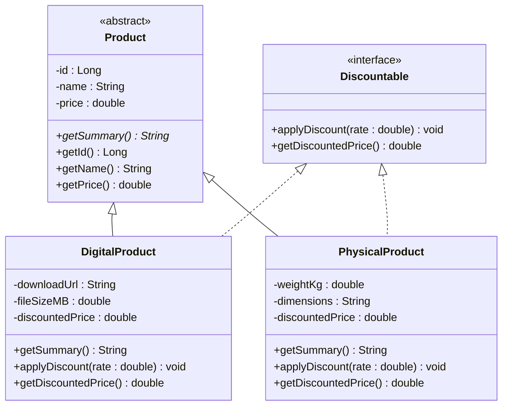

```mermaid
classDiagram
    class Product {
        <<abstract>>
        -id : Long
        -name : String
        -price : double
        +getSummary()* String
        +getId() Long
        +getName() String
        +getPrice() double
    }
    class Discountable {
        <<interface>>
        +applyDiscount(rate : double) void
        +getDiscountedPrice() double
    }
    class DigitalProduct {
        -downloadUrl : String
        -fileSizeMB : double
        -discountedPrice : double
        +getSummary() String
        +applyDiscount(rate : double) void
        +getDiscountedPrice() double
    }
    class PhysicalProduct {
        -weightKg : double
        -dimensions : String
        -discountedPrice : double
        +getSummary() String
        +applyDiscount(rate : double) void
        +getDiscountedPrice() double
    }
    Product <|-- DigitalProduct
    Product <|-- PhysicalProduct
    Discountable <|.. DigitalProduct
    Discountable <|.. PhysicalProduct
```